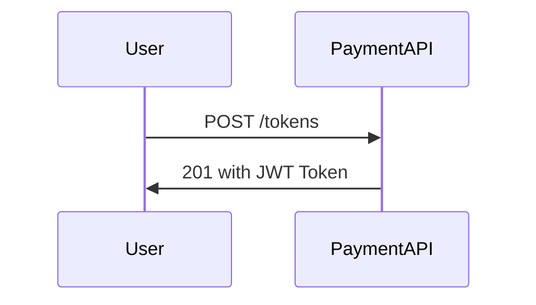
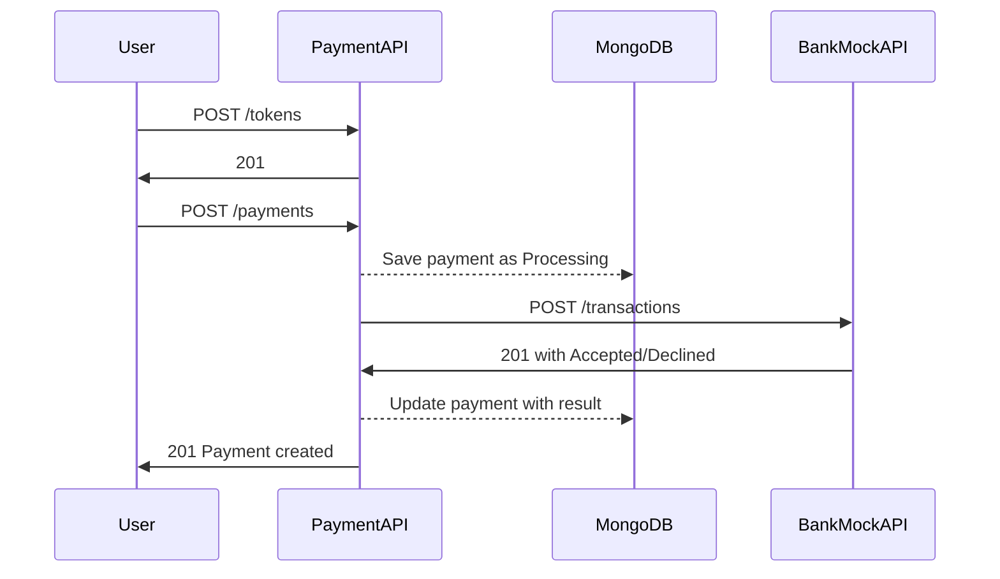
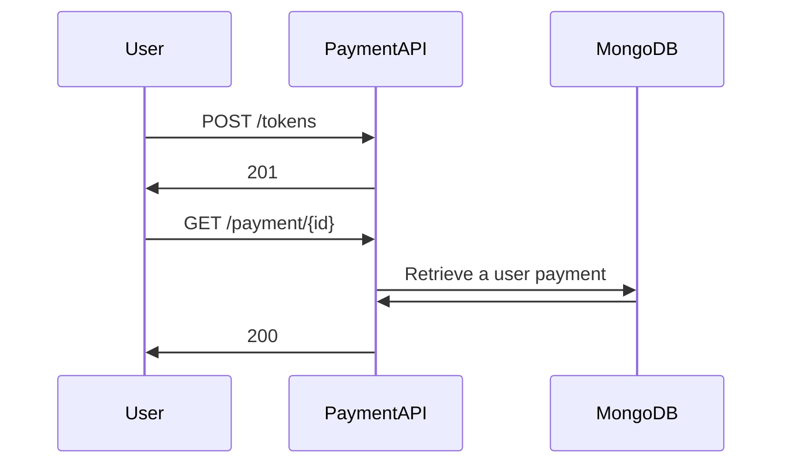
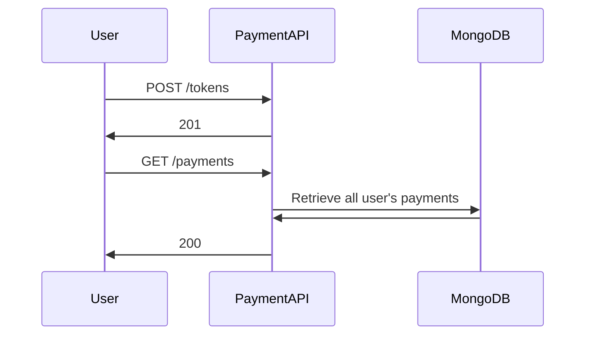

# Welcome to PaymentGateway solution! 👋🏻

This is a stack that runs in containers so make sure you have Docker 🐳 up and running on your machine before we continue. Enjoy!
## Go go go
1. `git clone` this repository  
2. ⚙️ `cd` it and get inside the directory where you cloned this repository  
3. 🚀 `docker-compose up --build --detach --force-recreate` and go grab a cup of coffee ☕️ 
4. 🎯 Hit it! You can use [Swagger](http://localhost:5000/swagger/index.html) to perform some requests, or you can find in the `./playground.rest` file some requests I used for my manual tests, I suggest follow them from top to bottom.
5. 📈 After playing around you can take a look at some metrics on [Prometheus Dashboard](http://localhost:9090/classic/graph?g0.range_input=1m&g0.stacked=0&g0.expr=http_requests_received_total&g0.tab=0&g1.range_input=1m&g1.expr=httpclient_requests_received_total&g1.tab=0) 

**Tip**: I usually use VSCode to perform requests and this file was built to run with this [plugin](https://marketplace.visualstudio.com/items?itemName=humao.rest-client).

## General solution design
Main idea was to keep it as simple as possible, considering it as a small piece of a larger ecosystem it would be nice to keep it easy to be maintained or even rewritten (for instance if the solution performs better in python 🐍)

**With `docker-compose up` command will get you these containers running:**

|Container|Port|Description|
|----------:|:-------------:|:-------------|
|payment-api|5000|Main App|
|bank-mock-api|5001|Mocks payment transaction responses|
|mongo|27017|App Database|
|mongo-express|8081|Easy way to take a look into the database|
|prometheus|9090|App and HttpClient (external calls) metrics|
|mongo-seed|Not binded|Initial DB seed with users|

#### Thoughts and assumptions that led me to this design:
 - I containerized it from start in order to have an OS agnostic solution so developers can start coding no matter if their OS is **Windows**, **OSX** or **Linux**.
 - It was hard to think of an API without any authentication/authorization flow, reason that there is **/tokens** endpoint.
 - As of the goal was to focus on the payments, I assumed a group of users pre-set, which is why I created a **mongo-seed** script to create these users and make it possible to play around with the API.
 - Eventhough it is simple I tried to separate into smaller yet meaningful domain resources **tokens**, **users** and **payments** each of the with their own **services** and **repositories** (when applicable)

#### What could be improved
 - BankMockAPI intention is to simulate an external AcquiringBank API to process payments and give a response. Even though this solution does not include integration tests, I would think of a way to replace this Mock API by Integration tests using **Test Server**.
	 - It would be one less dependency.
	 - It would be easier to add run in a **CI** pipeline.
 - To have an **Elastic Search** solution looking into the application logs and make them queryable with **Kibana**.
 - An API client could be provided, although it would be nice to have it in many different languages.
 - To have a robust way of **encrypting POST /transactions** since it deals with **PII**, although I don't have a good idea to deal with it now.
 - AutoMapper is doing the dirty work of **mapping Domain <-> API models**, there could be an overhead depending on the API throuput.

## Tech Stack

 - .NET 5
	 - FluentValidation
	 - AutoMapper
	 - prometheus-net.AspNetCore
 - Docker
 - MongoDB 4.4.3
 - Mongo Express 0.54.0
 - Prometheus

## PaymentAPI Use Cases

### Get an API Token (JWT)

	JWTs expire within a day and hold a userId inside

### Create a payment

### Retrieve a payment

### Retrieve all user's payments

## But I really want to debug the solution 🤓

- Let's run only the database part
	- `docker-compose up -d mongo mongo-seed`
- On a Terminal
	- Run in one tab `dotnet run -p ./src/PaymentAPI/PaymentAPI.csproj`
	- Run in another tab `dotnet run -p ./src/BankMockAPI/BankMockAPI.csproj`
- Using **VisualStudio** or **Rider**
	- Open `PaymentAPI.sln`
	- Run both `PaymentAPI` and `BankMockAPI`, they should start at `4000` and `4001` ports respectively.

Voilà! 😁